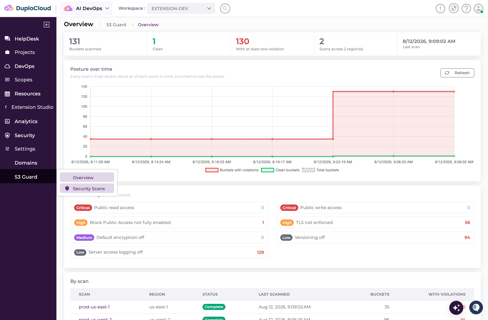
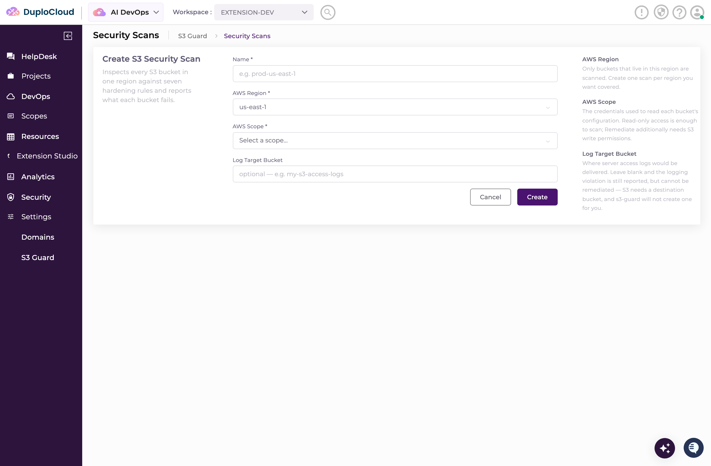
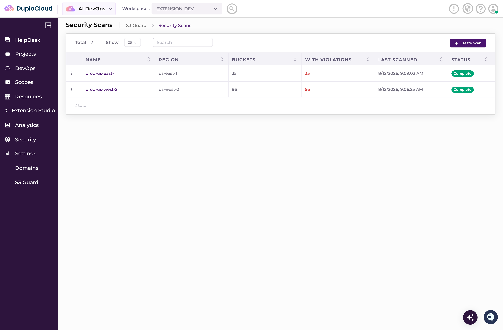
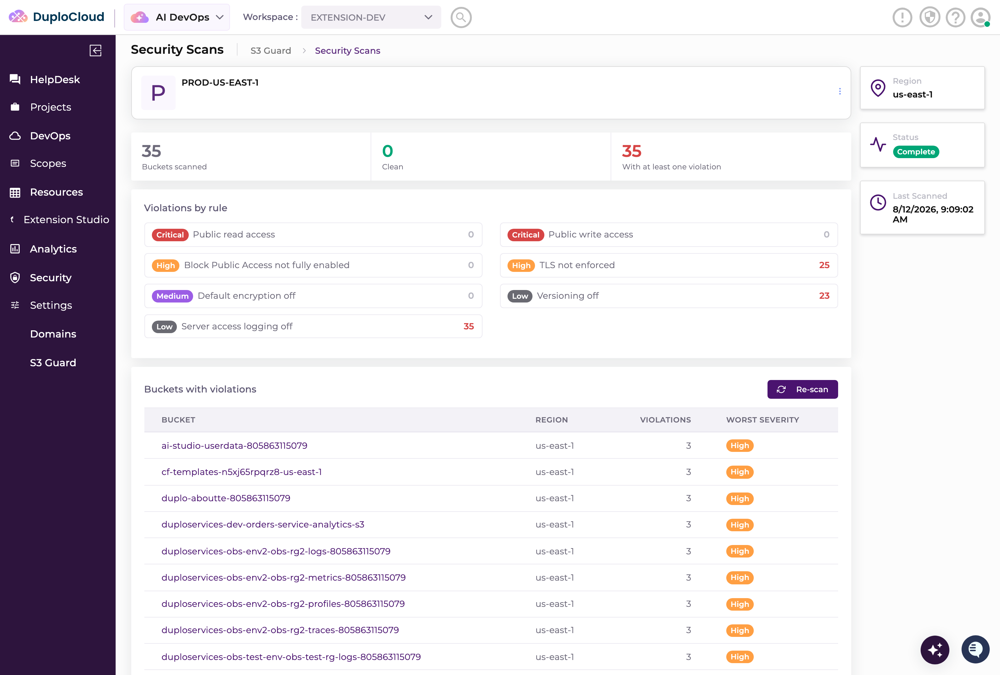
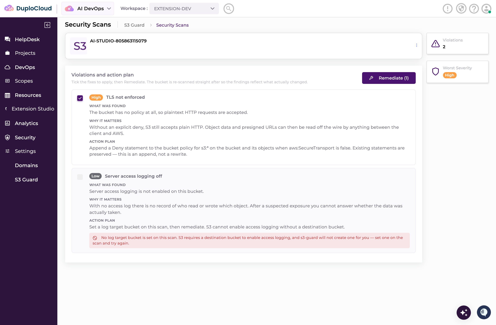
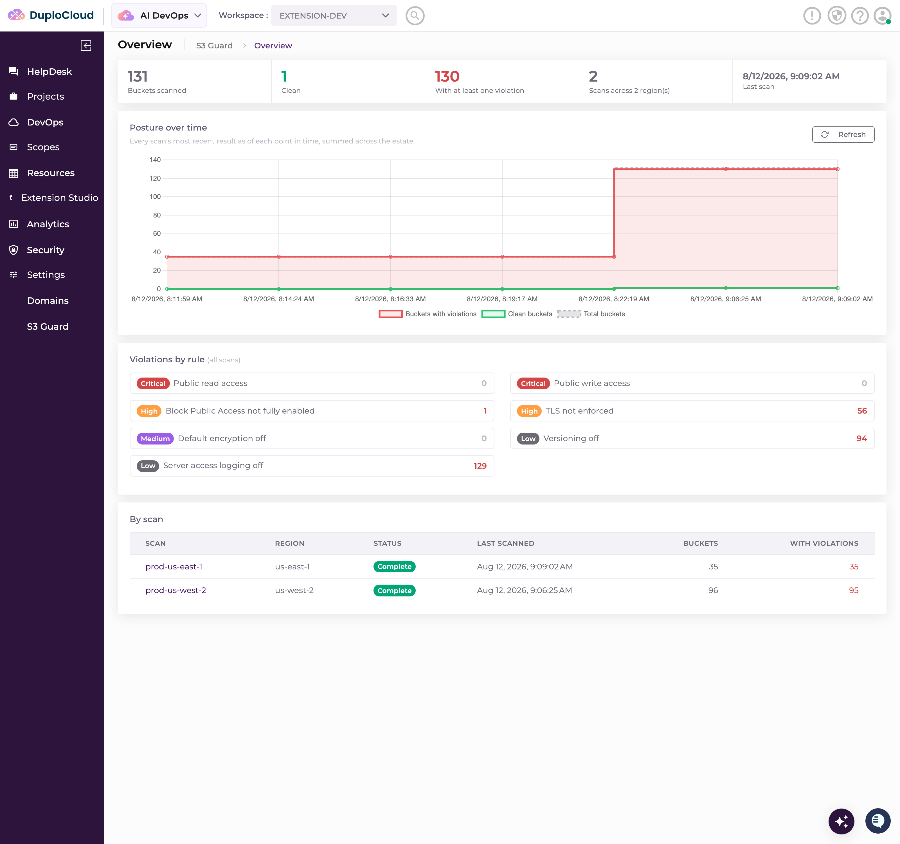

# 4. Build your first extension

**What you'll do:** build **s3-guard** — an S3 security posture dashboard — by describing it to
`/duplo-extension` in Claude Code, and load it into the platform you already have running.

**What you need first:** [2. Connect AWS](connect-aws.md) — the `aws-readonly` scope, attached to the
`extension-dev` workspace. The scan on this page reads a real AWS account through that scope, so it is
what makes the dashboard fill with your own buckets instead of nothing.

[3. Connect Kubernetes](connect-kubernetes.md) is **not** needed for this page. Nothing here touches a
cluster. If you skipped it, carry on.

---

## 4.1 What you are building

An **extension** is a first-class resource type. Not a plugin bolted onto a page, and not a script:
the platform gains a new kind of thing it can create, list, show and provision, with its own C#
backend (controller, service, entity, its own REST route and its own database collection), its own
Angular UI loaded into the portal as a remote, and its own provisioning logic. The platform
**hot-loads** it into the running stack — new route, new collection, new UI, no host restart. Once it
is loaded it is indistinguishable from a resource type that shipped with the product.

`s3-guard` is one such resource type, called **S3 Security Scan**. A scan is a thing you create — you
give it a name, an AWS region, the scope to scan with, and optionally a bucket to send access logs to
— and provisioning does the work:

- **The scan.** Using the scope's AWS credentials, it inspects every S3 bucket in that region and
  checks each one against these rules: Block Public Access not fully enabled, a policy or ACL allowing
  public read or public write (reported separately, so the dashboards show seven rows), default
  encryption off, versioning off, server access logging off, and TLS not enforced. Each rule carries a
  severity, from Critical down to Low. The results are stored on the resource rather than re-read live
  on every page load, and every run appends a summary snapshot.

- **The Overview.** The estate-wide dashboard, across every scan you have: totals, a count per rule,
  a table of all your scans, and a chart of posture over time — which is what those snapshots are for.
  This is the top of the feature, and it is deliberately not per-scan: one scan only ever shows one
  region, and the question worth asking is whether the whole account is getting better.

- **The scan detail page.** One region: how many buckets were scanned, how many are clean, how many
  have at least one violation, a count per rule, and a table of only the buckets that failed something.

- **The per-bucket detail view.** Click a failing bucket and you get every violation it has, what was
  found, why it matters, and an action plan describing the exact remediation for each one.

- **The Remediate button.** Each violation on that page is a checkbox, ticked by default. **Remediate**
  applies the fix for the ticked ones, re-scans that bucket, and updates its result. Read [4.4](#44-give-it-the-specification)
  before you press it.

There can be several scans — one per region, re-run over time — so they live under their own **S3 Guard**
group in the left navigation, with **Overview** and **Security Scans** in it.



You do not write any of this by hand. `/duplo-extension` interviews you, plans it, and builds it.

## 4.2 Open Claude Code in the dev kit

Leave the browser tab open; you come back to it in [4.6](#46-see-it-in-the-portal).

1. In a terminal or in VS Code, go to the directory you cloned on
   [1. Install and sign in](install.md#11-clone-the-dev-kit).

   ```bash
   cd my-extension
   ```

2. Start Claude Code **in that directory**.

   That matters. Claude Code picks up the `.claude/` directory in this repo, and that directory is the
   only reason `/duplo-extension` exists — it is defined in
   [`.claude/commands/duplo-extension.md`](../../.claude/commands/duplo-extension.md), and it hands off
   to the `duplo-extension-dev` skill, which reads the authoring guides in
   [`.claude/skills/duplo-extension-dev/reference/`](../../.claude/skills/duplo-extension-dev/reference)
   as it builds. Started anywhere else, Claude Code knows nothing about this dev kit and the command is
   not there.

## 4.3 Run `/duplo-extension`

```text
/duplo-extension
```

Before it asks you anything, it probes the platform: it reads `DUPLO_TARGET` from `.env` and checks
whether the local stack answers, along with any remote platform you have configured. Then it asks
where to build:

> Use the local dev-kit platform, or a remote one?

Choose **local**. That is the stack you brought up on page 1 and connected AWS to on page 2, and it is
the target the `scripts/` in this repo read from `.env` as well.

If it reports that the local stack is **down**, `./run.sh` is not running. Start it in another terminal,
then run the command again.

## 4.4 Give it the specification

With the target settled, the command asks what you want to build. The question arrives as a set of
options with **Other** at the bottom. Pick **Other** — the offered options are starting points, and you
are supplying the whole requirement — then paste the block below into the free-text box.

Paste it whole rather than inventing something of your own. Written out this way it settles nearly
everything the intake would otherwise draw out of you one question at a time — the resource shape, the
provisioning mode, where it lands in the navigation, how results are stored — so the command can go
almost straight to a plan.

```text
Build an extension called s3-guard: a security posture dashboard for S3 buckets.

Use the AWS scope attached to the dev workspace for testing — if the scope name I give you
doesn't exist, just use the one that's there, don't stop to ask. Remediate needs S3 write
permissions. If the scope is read-only every Remediate comes back AccessDenied, which is a
result to display per rule, not a bug to chase — but don't assume the scope is read-only
either. Report what actually happens, and tell me if a Remediate really changes a bucket.

One resource type, "S3 Security Scan". The spec is a name, an AWS region, the scope to scan
with, and an optional log target bucket. Provisioning uses the scope's AWS credentials to
inspect every S3 bucket in that region and check it against these rules:

  - Block Public Access is not fully enabled
  - the bucket policy or ACL allows public read or public write
  - default encryption is off
  - versioning is off
  - server access logging is off
  - TLS is not enforced (no aws:SecureTransport deny in the policy)

Severity per rule: public read/write are Critical, Block Public Access and TLS are High,
encryption is Medium, versioning and logging are Low.

Get the evidence right, not just the verdict. A bucket with no policy at all is a different
finding from a bucket whose policy lacks the deny, and each rule should say what was actually
observed. A bucket whose configuration can't be fully read should say so rather than silently
passing.

This is deterministic work — do it in a background worker, not an agent skill.

The result records, per bucket, which rules it fails. Store the results on the resource rather
than rescanning live on every page load, and have each run append a summary snapshot.

Put it in a new top-level nav group called "S3 Guard" with two items: Overview and Security
Scans.

Overview is the top-level dashboard and it is where the charts live. It aggregates across ALL
scans, not one: total buckets scanned, clean, and with at least one violation; a count per
rule; how many scans across how many regions; and a chart of posture over time for the whole
estate. Below that, a table of every scan — name, region, status, last scanned, buckets,
buckets with violations — that clicks through to the scan.

The estate timeline has to combine scans that are sampled at different times: one region might
re-scan hourly while another re-scans weekly. At each point in time, every scan contributes its
most recent snapshot at or before that moment, and those are summed. Do not just plot snapshots
in the order they arrive — that makes the estate look like it collapses to one region's size
every time a single scan re-runs. Each point should also carry how many scans were contributing,
so a step up in the total reads as "another scan started reporting" rather than "the estate grew".

Serve that aggregate from its own backend endpoint. Don't roll it up in the browser from the
list response — the list carries every bucket finding of every scan, which is tens of kB per
scan and grows with the estate, and the chart needs none of it.

Security Scans lists the scans. A scan's detail page covers that region only: total buckets
scanned, how many are clean, how many have at least one violation, a count per rule, and a
table of only the buckets that failed something — bucket name, region, number of violations,
worst severity. No chart on this page; a single scan's history is one region's slice, and the
trend question belongs at the estate level.

Clicking a bucket opens a detail view for that bucket showing every violation with what was
found and why it matters, and an action plan describing the exact remediation for each one.
Each violation is a checkbox, all ticked by default, and there is a Remediate button. Remediate
applies the fix for only the ticked violations, then re-scans that bucket and updates its
result, and shows the outcome of each rule it attempted.

Server access logging can't be turned on without a destination bucket. If the log target bucket
is set, remediate it; if it's blank, still report the violation but disable its checkbox and say
why. Don't auto-create a log bucket.

Scans can be re-run on demand, and re-running is what extends the trend.

Use chart.js for the charts. Build the frontend on whatever stack the current dev-kit template
ships — don't carry one over from an older dev-kit.

Deleting a scan tears nothing down, and never reverts a remediation.

Keep it to this one resource type. Do not add a parent-child hierarchy.
```

> **Remediate needs write access, and the scope from page 2 does not have it.** The IAM user you
> created on [page 2](connect-aws.md#21-create-an-iam-user-and-access-key) has `ReadOnlyAccess`. The
> scan only reads bucket configuration, so the Overview, the scan pages, the per-bucket detail, the
> violations and the action plans all work on read-only credentials. **Remediate** is the one thing that
> writes, so with that scope each ticked rule comes back `AccessDenied` — shown against the rule it
> belongs to. That is the credential refusing, not the extension failing, and there is nothing to chase.
> To make **Remediate** actually apply, give that IAM user write access to the buckets you want to fix,
> or attach a second, more privileged scope and scan with that one instead. Read-only is the safer
> default for a machine you have just set up, which is why page 2 chose it — and if you do point
> `s3-guard` at a scope that can write, remember that pressing **Remediate** changes real buckets.

## 4.5 Approve the plan

Claude Code does not start building from the paste. It works through the rest of its intake first:

1. **It confirms the name.** It proposes `s3-guard` back to you and says what that name drives — the
   extension id, the resource type, the REST route under `extensions/`, and the name of the UI remote.
   Confirm it or change it.

2. **It confirms the scope.** It lists the scopes the `extension-dev` workspace actually has and asks
   which to test with. `aws-readonly` from page 2 is the one you want; the specification already tells
   it to take whatever AWS scope is there rather than stopping to ask.

3. **It asks anything still genuinely ambiguous.** The specification is detailed enough that this
   should be short, and it may be nothing at all.

4. **Then it presents one plan.** Not a plan per file — one, covering the whole build: a table of spec
   fields, a table of result fields, a walkthrough of the UI (where it lands in the left nav, the
   create form, the list, the Overview and the scan detail), the files it will create under
   `extensions/s3-guard/`, and the exact build and deploy commands it intends to run.

Read that plan; it is your one chance to change the shape before anything is written. Then approve it
**once**. Approving covers the whole build, which is the point — the alternative is a permission prompt
for every `dotnet`, `npm` and `curl` along the way.

From there it runs unattended: scaffold the extension into `extensions/s3-guard/`, pin the host's SDK
version, compile the C# backend, install and build the Angular remote, package it all into
`extensions/s3-guard/dist/extension.zip`, and push that bundle into the running platform, which
hot-loads it. Those last two steps are the same two commands you would run by hand:

```bash
./scripts/build-extension.sh  extensions/s3-guard
./scripts/deploy-extension.sh extensions/s3-guard/dist/extension.zip
```

Their flags are in the [CLI reference](../cli-reference.md). If the build fails to reach the host SDK,
that symptom is in [troubleshooting.md](../troubleshooting.md#extensions).

## 4.6 See it in the portal

1. Go back to the browser and **reload the tab**. The left navigation is built when the portal loads,
   so a tab that was open through the deploy will not show the new group until you do.

2. **S3 Guard** is now a top-level group in the left nav, alongside the built-in sections, with
   **Overview** and **Security Scans** in it.

3. Open **Security Scans** and press **Create Scan**. Fill in the name and the AWS region you want to
   look at, select the `aws-readonly` scope, and leave the log target bucket blank unless you have a
   bucket to send access logs to.

   

4. Provisioning runs the scan in the background — no ticket and no agent, just a background worker, so
   the row moves from `New` to `Complete` on its own. A region with a few dozen buckets takes a minute
   or two.

   

5. Open the scan. Its detail page covers that one region: the totals, the per-rule counts, and the
   table of buckets that failed something.

   

6. Click one of those buckets. Every violation it has is listed with what was found, why it matters and
   the exact remediation — each one a checkbox, ticked by default. The greyed-out row is the design
   working: server access logging cannot be enabled without a destination bucket, so with no log target
   set on the scan the violation is still reported but its checkbox is disabled and it says why.

   

7. Now go to **Overview**. This is the estate-wide picture across every scan you have created — totals,
   violations by rule, the table of scans, and posture over time.

   

   The chart only becomes interesting once there is more than one data point, so create a second scan in
   another region, or press **Re-scan** on one you already have, and come back. Each scan contributes
   its most recent result at every point in time, which is why the line steps up when a second region
   first reports rather than replacing the first region's figure.

Nothing is scanned until you create a scan — an empty **S3 Guard** group straight after the deploy is
the extension working, not failing.

That is the whole loop, and it is the loop for anything else you build: describe it, approve one plan,
and it is a first-class part of the platform.

**Next:** [6. Where to next](where-to-next.md)

> **5. Use the Terraform extension — coming soon.** A walkthrough of the real, shipping Terraform
> extension is in progress and will be added here.
