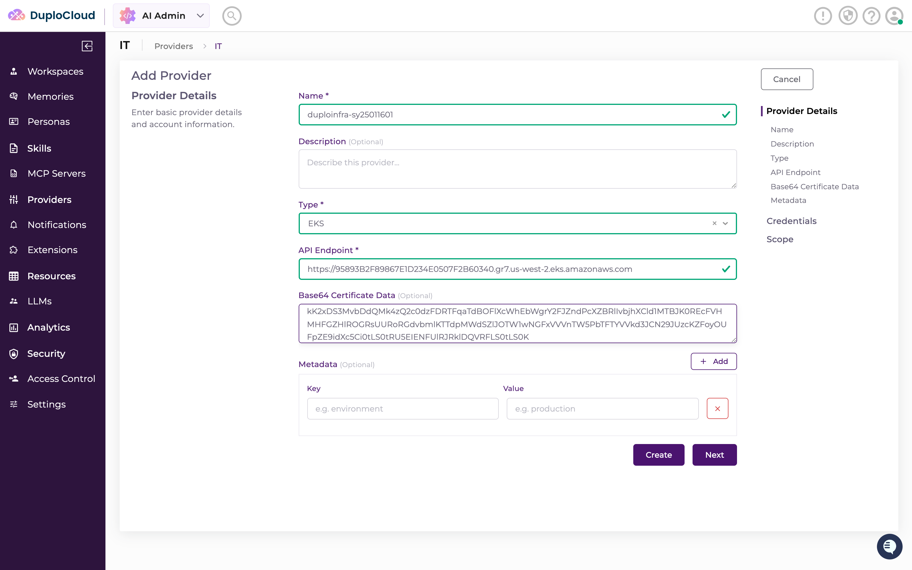
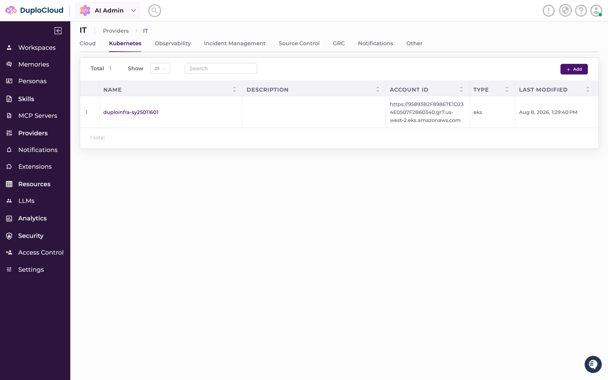
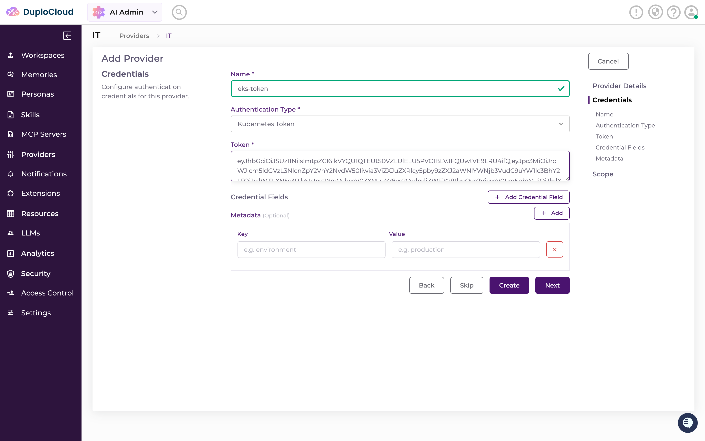
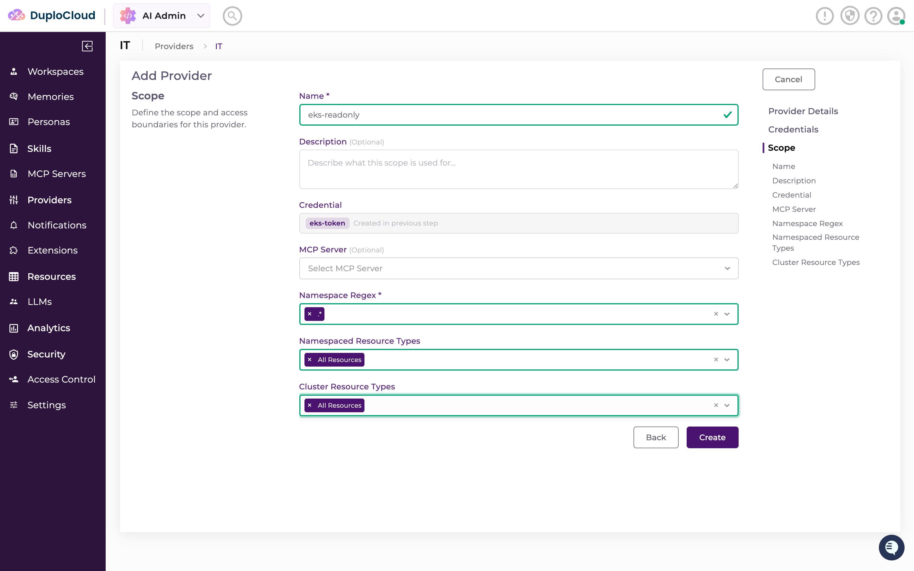
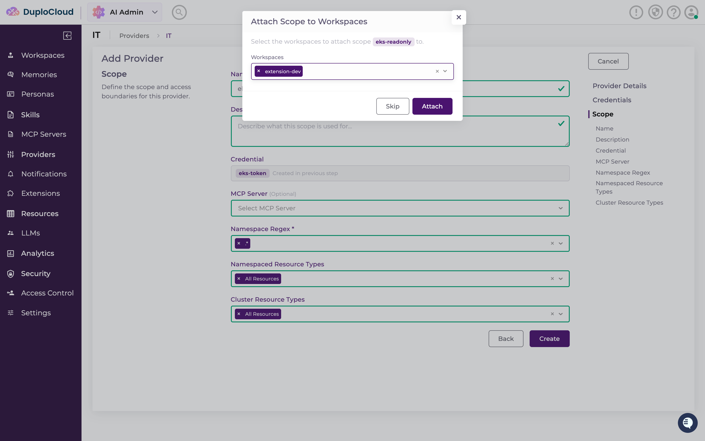
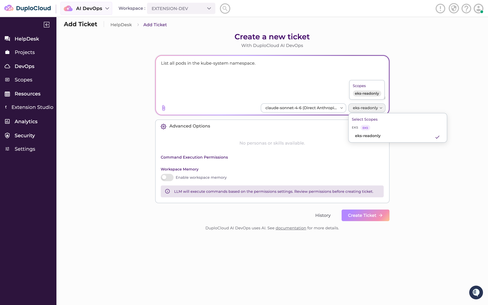
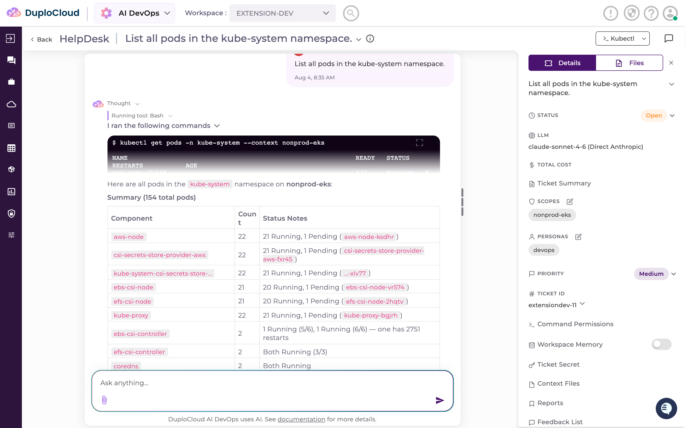

# 3. Connect Kubernetes

**What you'll do:** give the agent read-only access to an EKS cluster, then prove it works by asking
it what is running in `kube-system` and getting the real pods back.

**What you need first:** [1. Install and sign in](install.md) — the platform running locally and you
signed in to the portal. You also need an EKS cluster you have `kubectl` admin access to, and the AWS
CLI pointed at the account that cluster lives in. [2. Connect AWS](connect-aws.md) is **not** required
for this page — the two providers are independent — though you will normally have done it already.

---

## Why a token, and not a role

Same reasoning as the AWS page, one layer down. An IAM role has to be *assumed* by something that
already holds an AWS identity — a hosted HelpDesk deployment running inside AWS has one, and maps it
to a Kubernetes group so it never stores a cluster credential at all.

This dev kit is Docker Compose on your laptop. It has no AWS identity, so there is nothing for a role
to be assumed *from*. A **ServiceAccount token** is self-contained: it authenticates straight to the
cluster's API server, with no AWS identity anywhere in the path. That is what this page uses. The
production alternative is named at the [end of the page](#a-note-on-iam-roles).

## 3.1 Create a read-only ServiceAccount

Everything in this section runs against your cluster with `kubectl`, not in the portal.

1. Confirm `kubectl` is pointed at the cluster you mean to connect.

   ```bash
   kubectl config current-context
   ```

   You should see:

   ```
   arn:aws:eks:us-west-2:123456789012:cluster/<your-cluster-name>
   ```

   If it names a different cluster, point it at the right one:

   ```bash
   aws eks update-kubeconfig --name <your-cluster-name> --region <your-region>
   ```

2. Create the ServiceAccount. It goes in `kube-system` because it belongs to the cluster as a whole,
   not to any one workload's namespace.

   ```bash
   kubectl create serviceaccount duplocloud-agent -n kube-system
   ```

   You should see:

   ```
   serviceaccount/duplocloud-agent created
   ```

3. Bind it to the built-in `view` ClusterRole. `view` is read-only across every namespace and cannot
   read Secrets.

   ```bash
   kubectl create clusterrolebinding duplocloud-agent-view \
     --clusterrole=view \
     --serviceaccount=kube-system:duplocloud-agent
   ```

   You should see:

   ```
   clusterrolebinding.rbac.authorization.k8s.io/duplocloud-agent-view created
   ```

   Read-only is deliberate, not a placeholder to loosen later. Nothing in this guide writes to your
   cluster, and a getting-started credential should not be able to.

   `view` is read-only in one more sense worth knowing before [3.7](#37-prove-it-works): it grants
   reads on *namespaced* resources — Pods, Deployments, Services, ConfigMaps — and deliberately
   excludes cluster-scoped ones such as Nodes, Namespaces and PersistentVolumes. Asking the agent
   about nodes with this binding in place gets you a `Forbidden` from the API server, and that is
   expected rather than a sign of a broken setup. It is why the check in 3.7 asks about pods.

4. Create a long-lived token for the ServiceAccount.

   Kubernetes 1.24 and later no longer auto-creates a token Secret when you create a ServiceAccount,
   so you create one yourself. This is the one place in this guide where inline YAML is unavoidable —
   there is no imperative `kubectl` equivalent for a Secret of this type. Paste the whole block,
   closing `EOF` included:

   ```bash
   kubectl apply -f - <<'EOF'
   apiVersion: v1
   kind: Secret
   metadata:
     name: duplocloud-agent-token
     namespace: kube-system
     annotations:
       kubernetes.io/service-account.name: duplocloud-agent
   type: kubernetes.io/service-account-token
   EOF
   ```

   You should see:

   ```
   secret/duplocloud-agent-token created
   ```

   > **Do not use `kubectl create token duplocloud-agent`.** It is the shorter command, and it is the
   > one most search results hand you — but it mints a *bound* token with an expiry, commonly one
   > hour. It will work when you paste it into the portal and stop working while you are still
   > reading page 4, with an error that looks like a mistyped credential. The Secret above holds a
   > token that does not expire.

5. Read the token out. The Secret stores it base64-encoded, so decode it:

   ```bash
   kubectl get secret duplocloud-agent-token -n kube-system \
     -o jsonpath='{.data.token}' | base64 --decode
   ```

   You should see one long line — roughly a thousand characters, no line breaks, no trailing newline:

   ```
   eyJhbGciOiJSUzI1NiIsImtpZCI6IjhkNGMyYTFmOWU3YjNkNWE2YzhlMGYyYjRkNmE4YzNlNWY3YjlkMWEifQ.eyJpc3MiOiJrdWJlcm5ldGVzL3NlcnZpY2VhY2NvdW50Iiwia3ViZXJuZXRlcy5pby9zZXJ2aWNlYWNjb3VudC9uYW1lc3BhY2UiOiJrdWJlLXN5c3RlbSIsImt1YmVybmV0ZXMuaW8vc2VydmljZWFjY291bnQvc2VjcmV0Lm5hbWUiOiJkdXBsb2Nsb3VkLWFnZW50LXRva2VuIiwia3ViZXJuZXRlcy5pby9zZXJ2aWNlYWNjb3VudC9zZXJ2aWNlLWFjY291bnQubmFtZSI6ImR1cGxvY2xvdWQtYWdlbnQi…
   ```

   Keep this terminal open — the value goes in the **Token** field in [3.4](#34-add-the-credential).
   Copy **all** of it. A token cut short is indistinguishable from a wrong one to the API server, and
   it is the most common cause of an `Unauthorized` error later.

6. *(Optional)* Confirm the binding took effect before you go near the portal. Ask about a namespaced
   read, since that is what `view` grants and what 3.7 exercises:

   ```bash
   kubectl auth can-i list pods -n kube-system \
     --as=system:serviceaccount:kube-system:duplocloud-agent
   ```

   You should see:

   ```
   yes
   ```

## 3.2 Get the cluster endpoint and CA certificate

The portal needs two more things to reach the cluster: where its API server is, and the certificate
authority that signed that API server's TLS certificate. Both come from the AWS CLI.

1. Get the API endpoint.

   ```bash
   aws eks describe-cluster --name <your-cluster-name> \
     --query 'cluster.endpoint' --output text
   ```

   You should see a URL of this shape:

   ```
   https://A1B2C3D4E5F6A7B8C9D0E1F2A3B4C5D6.gr7.us-west-2.eks.amazonaws.com
   ```

2. Get the certificate authority data.

   ```bash
   aws eks describe-cluster --name <your-cluster-name> \
     --query 'cluster.certificateAuthority.data' --output text
   ```

   You should see a long base64 blob on one line:

   ```
   LS0tLS1CRUdJTiBDRVJUSUZJQ0FURS0tLS0tCk1JSURCVENDQWUyZ0F3SUJBZ0lJWjNaTXhOMHF0…
   ```

   The provider form asks for **Base64 Certificate Data**, and this value is *already*
   base64-encoded — that is simply how `describe-cluster` returns it. Paste it exactly as printed.
   Do not decode it first, and do not run it through `base64` again.

## 3.3 Add the provider

A **provider** is the system you are connecting — here, one EKS cluster: its address and its CA. The
token is a separate object, because one provider can hold several credentials.

Provider, credential and scope are **one wizard**, not three separate visits. Clicking **Add** opens a
page headed **Add Provider** with a progress rail down the right-hand side listing three steps:
**Provider Details**, **Credentials**, **Scope**. You move between them with **Next**. Sections 3.3,
3.4 and 3.5 below are those three steps, in order — do not leave the wizard between them.

1. Providers lives in **AI Admin**, not in AI DevOps. Click the app switcher at the top left — the
   button reading **AI DevOps** — and choose **AI Admin**.

2. Click **Providers** in that sidebar, then **IT**. (**GTM** is the other category; clusters are IT.)

3. Tabs run across the top: **Cloud**, **Kubernetes**, Observability, Incident Management, Source
   Control, GRC, Notifications, Other. Open **Kubernetes** — that is where EKS lives, not the
   **Cloud** tab you used on [page 2](connect-aws.md#22-add-the-provider).

4. Click **Add** (top right). The **Add Provider** page opens on step 1, **Provider Details**.

5. Fill in:

   | Field | Value |
   | --- | --- |
   | **Name** | `<your-cluster-name>` — the EKS cluster this provider points at, e.g. `duploinfra-sy25011601` |
   | **Type** | `EKS` |
   | **API Endpoint** | `<your cluster API endpoint>` — from [3.2](#32-get-the-cluster-endpoint-and-ca-certificate) |
   | **Base64 Certificate Data** | `<your cluster CA data>` — from [3.2](#32-get-the-cluster-endpoint-and-ca-certificate) |

   **Name it after the cluster.** A provider is exactly one cluster, and the name is what you will be
   picking from lists once there are several — so `duploinfra-sy25011601` tells you which cluster you
   are looking at where a generic `eks` does not. The field accepts letters, digits, `-` and `_`, and
   must start with a letter, which an EKS cluster name already satisfies.

   **Type** offers `EKS`, `AKS`, `GKE`, `RHOS` and `Other`. Pick `EKS`.

   

6. Click **Next**.

   **Create** appears next to it once the form is valid. That saves the provider on its own and closes
   the wizard, leaving you with no credential and no scope. Use **Next**.

   When you do finish the wizard, the provider appears in the list on the **Kubernetes** tab. The
   **ACCOUNT ID** column holds the API endpoint you just entered:

   

## 3.4 Add the credential

You are now on step 2 of the same wizard, **Credentials**. The provider says *which* cluster. The
credential says *how to authenticate to it*.

1. Fill in:

   | Field | Value |
   | --- | --- |
   | **Name** | `eks-token` |
   | **Authentication Type** | `Kubernetes Token` — already selected, leave it |
   | **Token** | `<your decoded ServiceAccount token>` — from [3.1](#31-create-a-read-only-serviceaccount) |

   

   The token in that screenshot is a redacted placeholder — yours will be the real one you decoded in
   [3.1](#31-create-a-read-only-serviceaccount).

2. Click **Next**.

   **Back** returns to Provider Details. **Skip** moves on without a credential, and **Create** (which
   appears once the form is valid) saves and closes here — leaving you no scope. You want **Next**.

## 3.5 Add a scope

The last step of the wizard is **Scope**.

A **scope** is the boundary of what the agent may touch: a credential, and the resources that
credential may be used against. Both HelpDesk tickets and extensions target a scope.

When a ticket runs, the platform expands the scope into its provider and credential and hands them to
the agent, which writes them into the ticket's working directory — for Kubernetes, as a context in a
`.kube/config` that `kubectl` then uses. The context is **named after the scope**, which is why the
command the agent runs in [3.7](#37-prove-it-works) carries `--context <your-scope-name>`. Nothing
outside the scope is materialized, so nothing outside it is reachable.

1. Fill in:

   | Field | Value |
   | --- | --- |
   | **Name** | `eks-readonly` |
   | **Credential** | `eks-token` — filled in for you, marked *Created in previous step* |
   | **MCP Server** | leave empty — it is optional and this page does not use one |
   | **Namespace Regex** | `.*` — type it and **press Enter** to turn it into a chip |
   | **Namespaced Resource Types** | `All Resources` |
   | **Cluster Resource Types** | `All Resources` |

   **Namespace Regex** is a tag field, not a text box: what you type only registers once you press
   Enter and it becomes a chip. Leaving it as loose text is the easiest way to have **Create** refuse.

   **Namespace Regex** is a **regular expression** matched against namespace names to decide which
   ones the scope can see — so "everything" is `.*`, not the shell-style `*`. (`All Resources` in the
   two fields below it stores `.*` for the same reason.) To narrow it later, give a tighter pattern:
   `production-.*` restricts the scope to namespaces whose names begin with `production-`.

   The two **Resource Types** fields split the same idea by kind — namespaced resources (Pods,
   Deployments, Services) and cluster-scoped ones (Nodes, Namespaces, PersistentVolumes). The check in
   [3.7](#37-prove-it-works) reads pods in a namespace, so it is **Namespaced Resource Types** that
   has to stay at `All Resources`. Leaving **Cluster Resource Types** at `All Resources` too costs you
   nothing: the scope only sets an upper bound, and the ServiceAccount's own RBAC still decides what
   actually comes back. With the `view` binding from [3.1](#31-create-a-read-only-serviceaccount),
   cluster-scoped reads are refused by the API server whatever the scope permits.

   

2. Click **Create** to finish the wizard. This step has no **Next** — **Create** is the end of it.

   The provider, its credential and its scope are saved together, and a green
   *"Provider `<your-cluster-name>` created successfully with credentials and scope"* confirms it.

## 3.6 Attach the scope to the workspace

As with AWS, creating the scope does not make it usable — a ticket can only select scopes attached to
the workspace it is filed in. The wizard offers it straight away, exactly as it did on
[page 2](connect-aws.md#25-attach-the-scope-to-the-workspace).

1. Creating the scope pops up **Attach Scope to Workspaces** — *"Select the workspaces to attach scope
   `eks-readonly` to."*

   

2. Open the **Workspaces** control and pick **extension-dev**.

3. Click **Attach** — not **Skip**. A scope that is not attached is created but invisible to every
   ticket, which looks exactly like the scope having failed to save.

## 3.7 Prove it works

Connecting the cluster is not done until the agent has actually answered a question about it.

Switch back to **AI DevOps** with the app switcher at the top left before you start.

1. Go to **HelpDesk** → **Add Ticket**. The page is headed *Create a new ticket*.

2. In the large text box — placeholder *"Enter your ticket description for the LLM to help you solve
   it"* — type your question:

   ```
   List all pods in the kube-system namespace.
   ```

   Every cluster that is running at all has pods in `kube-system`, so this is a question with a real
   answer on any cluster you can connect. It is also a *namespaced* read, which is what the `view`
   binding from [3.1](#31-create-a-read-only-serviceaccount) grants.

3. Leave the model selector at the bottom right of that box alone. It is already set, and reads your
   model followed by `(Direct Anthropic)` with a sub-line of `SDK: local-agent` — for example
   `claude-sonnet-4-6 (Direct Anthropic)`. There is no separate agent to choose.

4. Check the scope. The scope selector is the second dropdown at the bottom right of the ticket box,
   next to the model selector. If `eks-readonly` is your only scope it is **already selected** and
   reads `eks-readonly` — there is nothing to do.

   Open it if you want to confirm: the panel is headed **Select Scopes**, and each entry shows the
   scope name under a small type badge — `EKS` for this one, `AWS` for the scope you made on page 2.
   If you did page 2, make sure only `eks-readonly` is ticked; leaving the AWS scope picked as well is
   harmless but hands the agent two sets of credentials for a question that needs one.

   

   A scope is **required** — **Create Ticket** stays disabled until the box has both text and a scope.
   Picking the scope is what causes the platform to expand it into its provider and credential and
   hand them to the agent.

   

5. Click **Create Ticket**.

6. **Approve the command.** The ticket opens, the agent thinks for a moment, and then it stops and
   asks permission before running anything. You get a *Thought* line, a *Running tool: Bash* line, the
   sentence *"I would like to execute the following commands and request your approval to proceed :"*,
   and a black code block holding the command it wants to run — a `kubectl` call against the context
   your scope produced.

   Below that: **Approve** / **Reject** / **Ignore** with **Approve** already selected, a **Remember
   for this ticket** checkbox, and a **Submit** button. Nothing runs until you click **Submit**.

   Tick **Remember for this ticket** first if you would rather not be asked again for the rest of this
   ticket, then click **Submit**.

**What success looks like:** the command runs — `kubectl get pods -n kube-system --context
<your-scope-name>` — and the agent replies in the thread with the pods that are actually running in
your cluster, followed by a summary table of Component, Count and Status Notes:



Recognize those workloads and Kubernetes is connected: a real token, reaching a real cluster, through
the scope. Note the `--context` in the command — that context exists only because the scope was
expanded for this ticket, and it is named after the scope. The rail on the right carries a **SCOPES**
chip with that same name.

An empty list is not a pass. A running cluster always has pods in `kube-system`, so an empty answer
means the agent reached nothing. See
[troubleshooting.md](../troubleshooting.md#providers-aws-and-kubernetes).

> **If you ask about nodes instead, expect to be refused.** The `view` ClusterRole bound in
> [3.1](#31-create-a-read-only-serviceaccount) covers namespaced resources only, so a cluster-scoped
> read comes back as:
>
> ```
> Error from server (Forbidden): nodes is forbidden: User "...DuploCloud-EKS-ReadOnly-..."
> cannot list resource "nodes" in API group "" at the cluster scope
> ```
>
> That is the read-only binding working as intended, not a broken connection. Widening it is a
> decision about your cluster's RBAC, not something this guide does for you.

## A note on IAM roles

> **IAM Role is the production path, and it does not apply here.** An EKS cluster can map an IAM role
> to a Kubernetes group, so a DuploCloud deployment running inside AWS authenticates as itself and no
> long-lived cluster token is ever stored. That requires an AWS identity for the role to be assumed
> *from* — which Docker Compose on a laptop does not have, which is why this page uses a
> ServiceAccount token instead. When you move to a hosted deployment, the same provider takes a
> credential of type **IAM Role**, and the scope above is unchanged. Nothing in this guide needs to be
> redone.

**Next:** [4. Build your first extension](build-your-first-extension.md)
