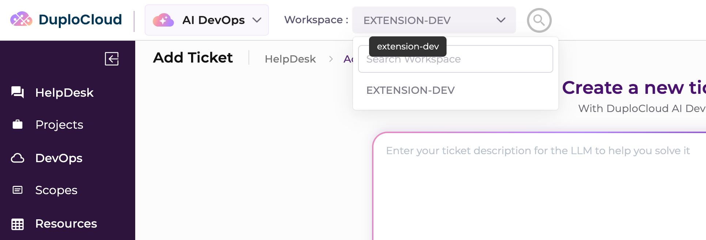

# 1. Install and sign in

**What you'll do:** Clone the dev kit, adopt it as your own repo, bring the platform up with
`./run.sh`, verify your email, and sign in.

**What you need first:** [0. Prerequisites](prerequisites.md) — Docker with Compose v2, Python 3, LLM access, and a
work email address you can read right now.

---

## 1.1 Clone the dev kit

You clone the dev kit once, then make it yours. Your extensions live in `extensions/<name>/`; everything
else is framework that stays refreshable.

1. Clone it, into a directory named for your project.

   ```bash
   git clone https://github.com/duplocloud/devkit my-extension
   cd my-extension
   ```

   You should see:

   ```
   Cloning into 'my-extension'...
   remote: Enumerating objects: 1284, done.
   remote: Total 1284 (delta 421), reused 1284 (delta 421), pack-reused 0
   Receiving objects: 100% (1284/1284), 4.21 MiB | 8.35 MiB/s, done.
   Resolving deltas: 100% (421/421), done.
   ```

Framework upgrades do not come from `origin` — [`./scripts/upgrade_dev_kit.sh`](../upgrading.md) always
pulls from the official dev-kit URL, whatever you re-point your remote to in the next step.

## 1.2 Make the checkout yours

`init-project.sh` re-points the repo at your remote **and** seeds your first extension under
`extensions/<name>/`. Everything outside `extensions/` is framework that stays refreshable.

1. Adopt the clone.

   ```bash
   ./scripts/init-project.sh git@github.com:<your-github-user>/<your-repo>.git
   ```

   You should see:

   ```
   ==> Adopting this dev-kit clone as your project
       your remote : git@github.com:<your-github-user>/<your-repo>.git
       devkit src  : https://github.com/duplocloud/devkit @ <commit-sha>
       history     : FRESH (rm -rf .git; new init)
       seeded extensions/helloworld from samples/helloworld (run /duplo-extension to reshape it, or edit by hand)
   ==> Changing git owner → git@github.com:<your-github-user>/<your-repo>.git
   ==> Done. This repo is now yours.
       • author your extension in extensions/helloworld  (or run /duplo-extension in Claude Code)
       • add more extensions later under extensions/<another-name>/
       • build one:  ./scripts/build-extension.sh extensions/helloworld
       • build all:  ./scripts/build-all.sh
       • deploy all: ./scripts/deploy-all.sh
       • push:       git push -u origin main
       • update the framework later: ./scripts/upgrade_dev_kit.sh --version main
   ```

2. Useful variations — pick one instead of the plain form above if it fits:

   ```bash
   ./scripts/init-project.sh git@github.com:<your-github-user>/<your-repo>.git --name <slug>   # name the first extension dir
   ./scripts/init-project.sh git@github.com:<your-github-user>/<your-repo>.git --no-sample     # no starter, just a placeholder
   ./scripts/change_git_owner.sh git@github.com:<your-github-user>/<your-repo>.git             # take ownership only, seed nothing
   ```

   Both scripts start a **fresh git history** by default; pass `--keep-history` to keep the dev kit's and
   only re-point `origin`.

## 1.3 Start the platform

1. Run it. There is no `.env` to create first — `./run.sh` copies one from `.env.example` if you do
   not already have one, prefilled with released image pins.

   > **Know a port from [0.5](prerequisites.md#05-free-ports) is already taken?** Create the file
   > first with `cp .env.example .env`, change that one `*_PORT` value — change it, do not delete the
   > line — and then run. Otherwise `./run.sh` fails on the bind, and you fix it the same way before
   > re-running.

   ```bash
   ./run.sh
   ```

   The first prompt is your admin email. Use the work address from
   [0.4](prerequisites.md#04-an-email-address-you-can-read): it is both your portal login and the address
   the verification link is sent to.

   ```
   ==> Setup (prompts appear only for values not already set)…
   Admin email: <you@yourcompany.com>
   ==> Verifying your email address <you@yourcompany.com>…
   ```

## 1.4 Verify your email address

Setup requires a **verified business email address**. `./run.sh` emails you a verification link and
**the run blocks here until you click it** — then it continues on its own.

1. Watch for this, and go read your inbox:

   ```
   ==> Check your email: <you@yourcompany.com> has to be verified before this run can continue.
       Click the verification link you were emailed — this run then continues on its own,
       waiting up to 2 minute(s).
       waiting....
   ```

2. Click the link. Leave the terminal alone — it is polling, and picks the result up by itself:

   ```
       waiting...... verified.
   ```

   `./run.sh` then carries on to the next prompt.

**If the wait times out, nothing is lost.** Your verification stays pending and completes the moment you
click the link, however much later that is. Re-run `./run.sh` afterwards and it resumes the same
request — no second email is sent.

## 1.5 The rest of the prompts

With your address verified, `./run.sh` asks for everything else. It prompts **only** for values not
already set, so a second run is silent.

| Prompt | What to enter |
| --- | --- |
| `Admin password:` | Your portal password. Not echoed. Remember it — the database keeps it, and a later `.env` edit cannot change it. |
| `Select LLM provider:` → `Enter 1 or 2:` | `1` for `anthropic (API key)`, `2` for `bedrock (AWS keys)`. On an EC2 instance with a working Bedrock role, option `3` uses that role with no keys. |
| `Anthropic API key:` *(provider 1)* | Your `sk-ant-…` key. Not echoed. |
| `AWS access key id:` / `AWS secret access key:` *(provider 2)* | Your Bedrock credentials. |
| `Opt out of usage metrics? [y/N]:` | Enter keeps you opted **in**. `y` opts out. |

The provider menu prints exactly this:

```
Select LLM provider:
  1) anthropic (API key)
  2) bedrock (AWS keys)
Enter 1 or 2: 1
```

On an EC2 instance with a working role, the menu also prints
`3) bedrock via this EC2 instance role — <role> @ <region>, no keys` and the prompt becomes
`Enter 1, 2 or 3:`.

The metrics question is last, on purpose:

```
DuploCloud collects product usage metrics from this dev kit.
Opt out of usage metrics? [y/N]:
```

What is and is not collected is spelled out in [PRIVACY.md](../../PRIVACY.md). You can change your mind
afterwards — set `DUPLO_USAGE_METRICS` to `0` or `1`, re-run `./run.sh`, and reload the UI tab. See
[configuration.md](../configuration.md#usage-metrics).

Every `./run.sh` flag is in the [CLI reference](../cli-reference.md#runsh).

## 1.6 The ready banner

`./run.sh` pulls the images, starts the stack, waits for the studio, mints a permanent admin token,
creates the `extension-dev` workspace, grants your user access to it, and registers the agent. On a cold
machine the pull is the slow part.

You are done when you see:

```
✔ Platform ready (provider: anthropic)
  UI        http://localhost:4210     (login: <you@yourcompany.com>)
  API       http://localhost:60031
  Workspace extension-dev  (68d1f0c2a4b95e0c3d7e1a42)  ·  agent registered + attached
  Token     DUPLO_ADMIN_TOKEN set in .env (permanent)
  LLM       System default → claude-sonnet-4-6 (direct Anthropic)
  Metrics   on (opted in)
            change: set DUPLO_USAGE_METRICS=0|1 in .env, re-run ./run.sh, reload the UI tab  ·  see PRIVACY.md

Build & deploy your extension (scripts read the target from .env — no DUPLO_BASE= prefix needed):
  ./scripts/build-extension.sh  extensions/<name>               # your extensions live in extensions/<name>/
  ./scripts/deploy-extension.sh extensions/<name>/dist/extension.zip
  # or build every extension:    ./scripts/build-all.sh
  # or build a bundled sample:   ./scripts/build-extension.sh samples/helloworld
  # re-attach the agent to another workspace: ./scripts/register-agent.sh <workspace-id>
```

Re-running `./run.sh` from here is safe and idempotent: every step above is skipped when it is already
satisfied. What the values in that banner mean is in
[configuration.md](../configuration.md#created-by-runsh).

## 1.7 Sign in

1. Open <http://localhost:4210>.

2. Sign in with the credentials you just gave `./run.sh`:

   | Field | Value |
   | --- | --- |
   | **Email** | `<you@yourcompany.com>` |
   | **Password** | the password from [1.5](#15-the-rest-of-the-prompts) |

   You land in the portal with the `extension-dev` workspace selected.

## 1.8 Confirm your workspace

You are signed in, which means the platform is up and your account works. One thing left to confirm:
`./run.sh` also created a **workspace** for you to build in, and put you in it.

Look at the top of the page. Next to **Workspace :** the selector reads **EXTENSION-DEV**. Open it and
`extension-dev` is listed — that is the workspace `./run.sh` created and attached the agent to.



That is page 1 done. You have the platform running, an account that signs in, and a workspace to work
in — everything the rest of the guide builds on.

If the selector is empty or reads something else, `./run.sh` did not finish its workspace step; re-run
it (it is idempotent) and check the banner from [1.6](#16-the-ready-banner).

**Next:** [2. Connect AWS](connect-aws.md) — you will give the platform read-only AWS credentials, which
produces the **scope** a ticket needs, then file the first ticket the agent can actually answer.
