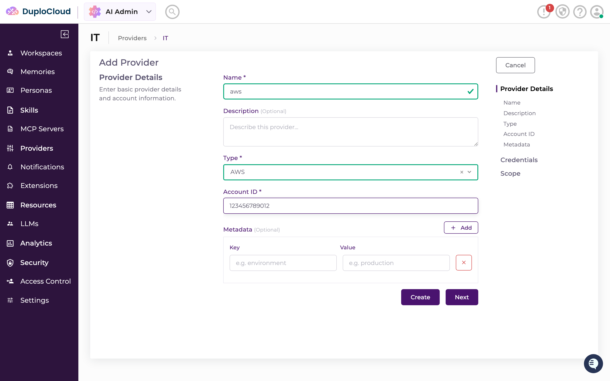
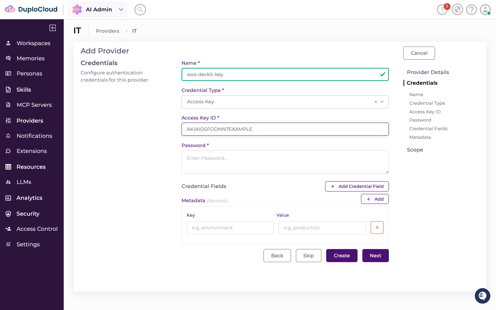
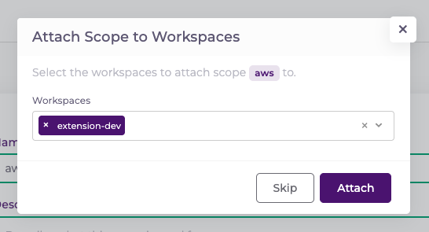
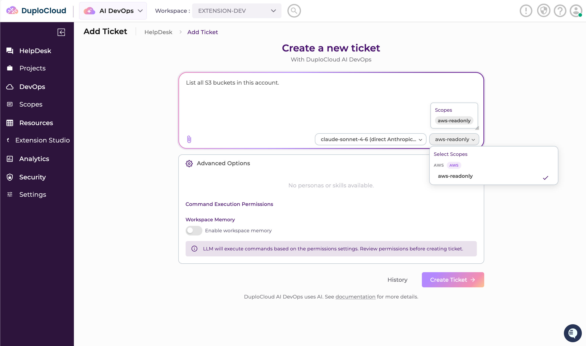
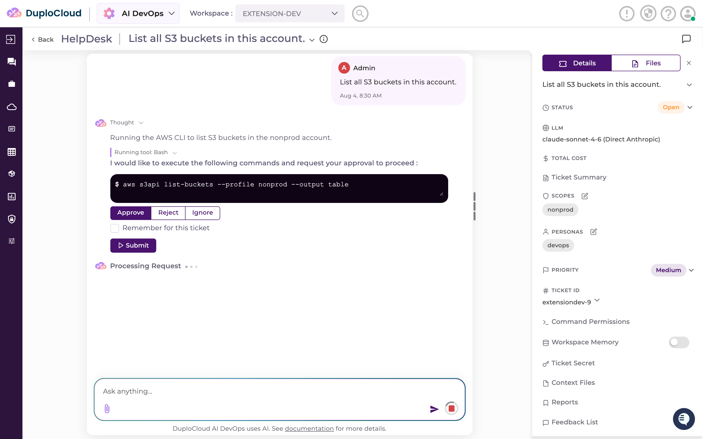
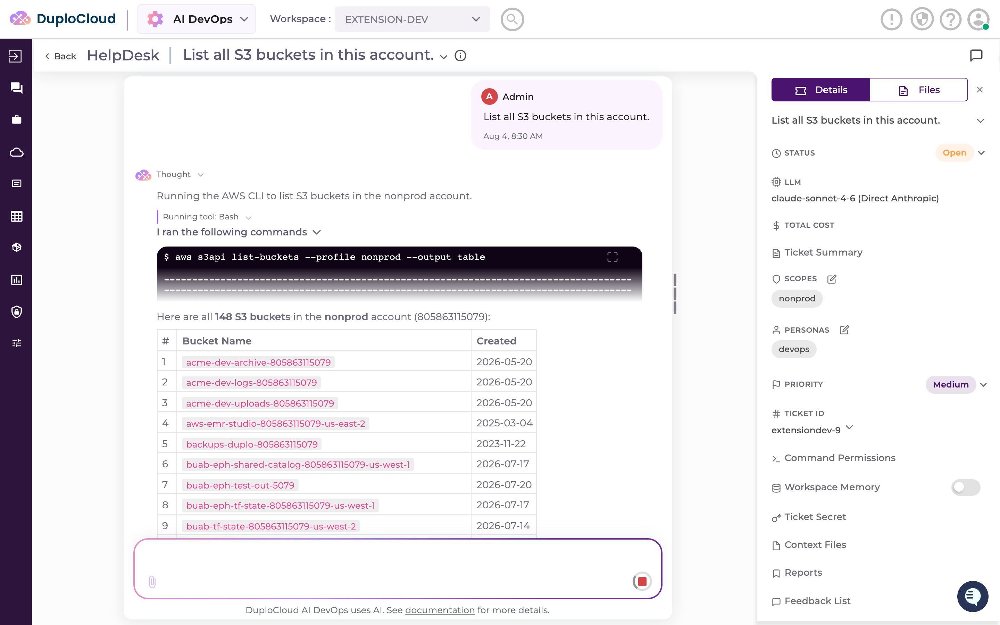
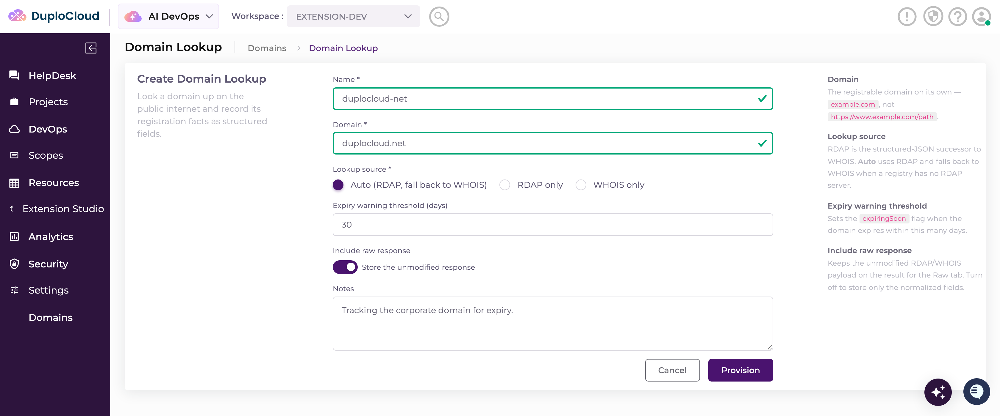
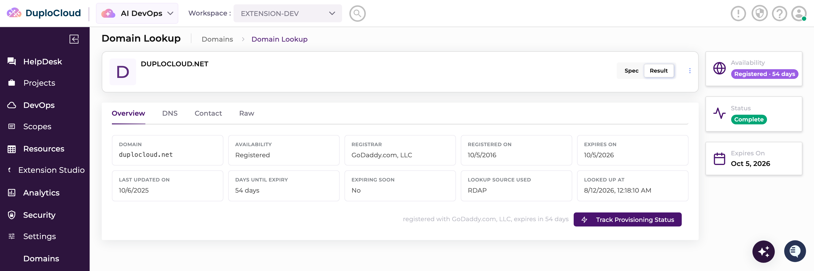
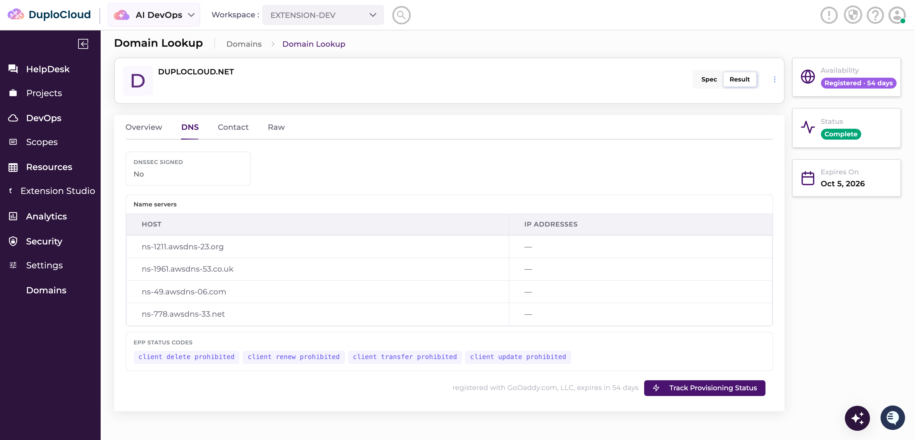

# Quickstart

Zero to a running DuploCloud AI HelpDesk platform, your AWS account connected, and the agent answering a
real question about it.

This is the quickstart, so it sticks to the commands and click-paths you need to get running. If you
would rather have the reasoning behind each step, the output to expect along the way, and the
Kubernetes and extension-authoring pages, the full
[getting started guide](getting-started/README.md) covers the same ground in more depth.

---

## 1. Prerequisites

You need Docker with Compose v2, `python3` on your `PATH`, an LLM key (an Anthropic `sk-ant-…` key, or AWS credentials with
access to Bedrock), and a **work email address**.

```bash
docker --version && docker compose version
```

## 2. Install

1. Clone the dev kit.

   ```bash
   git clone https://github.com/duplocloud/devkit my-agent
   cd my-agent
   ```

2. Adopt the clone and seed your first extension.

   ```bash
   ./scripts/init-project.sh git@github.com:<your-github-user>/<your-repo>.git
   ```

3. Start it. `./run.sh` creates `.env` from `.env.example` on first run, prefilled with released
   image pins.

   ```bash
   ./run.sh
   ```

   `./run.sh` prompts for `Admin email:` — use the work address. It then **blocks**: DuploCloud emails a
   verification link, and the run waits (up to 2 minutes) for you to click it before continuing on its
   own. If the wait times out nothing is lost — click the link, re-run `./run.sh`, and it resumes the same
   request without sending a second email.

   The remaining prompts: `Admin password:` (remembered by the database, not changeable by editing `.env`
   later), `Select LLM provider:` → `Enter 1 or 2:` (`1` anthropic, `2` bedrock) and its key, and
   `Opt out of usage metrics? [y/N]:`.

4. `./run.sh` prints a `✔ Platform ready` summary when the stack is up. Sign in at
   <http://localhost:4210> with that email and password. You land with the `extension-dev` workspace
   selected.

You cannot file a ticket yet — a ticket requires a scope, which step 4 creates.

## 3. Create an AWS access key

In your AWS console:

1. **IAM** → **Users** → **Create user**.
2. **User name**: `duplocloud-devkit`.
3. Leave **Provide user access to the AWS Management Console** *unchecked*.
4. **Next** → **Attach policies directly** → tick **`ReadOnlyAccess`**.
5. **Next** → **Create user**.
6. Open the user → **Security credentials** tab → **Access keys** → **Create access key**.
7. Use case **Third-party service**, tick the confirmation checkbox → **Next** → **Create access key**.
8. Copy **both** the access key and the secret access key. **The secret is shown once** — if you lose it,
   delete the key and create another.

## 4. Connect AWS

Provider, credential and scope are **one wizard**: app switcher (top left, reads **AI DevOps**) →
**AI Admin** → **Providers** (sidebar) → **IT** → **Cloud** tab → **Add** (top right). The page is
headed **Add Provider**, with a rail on the right listing **Provider Details** → **Credentials** →
**Scope**. Steps a, b and c are those three.

### a. Provider

Step 1, **Provider Details**:

| Field | Value |
| --- | --- |
| **Name** | `aws` |
| **Type** | `AWS` |
| **Account ID** | `<your 12-digit AWS account ID>` |

→ **Next**. (Not **Create** — that closes the wizard with no credential and no scope.)



### b. Credential

Step 2, **Credentials**:

| Field | Value |
| --- | --- |
| **Name** | `aws-devkit-key` |
| **Credential Type** | `Access Key` |
| **Access Key ID** | `<your AWS access key ID>` |
| **Password** | `<your AWS secret access key>` |

The secret goes in the field labelled **Password**. → **Next**.



### c. Scope

Step 3, **Scope**. Set **Name** to `aws-readonly`, leave **Description** and the MCP Server selection
alone and select your default region → **Create**.

### d. Attach the scope to the workspace

Creating the scope pops up **Attach Scope to Workspaces**. **Do not press Skip** — a scope that is not
attached to a workspace never appears on a ticket.

Pick **extension-dev** under **Workspaces** → **Attach**.



## 5. Ask the agent

App switcher → **AI DevOps**, then:

1. **HelpDesk** → **Add Ticket** (headed *Create a new ticket* / *With DuploCloud AI DevOps*).
2. In the large text box, type your question:

   ```
   List all S3 buckets in this account.
   ```

3. Leave the model selector at the bottom right of the box alone — already set.
4. **Select Scopes** → **`aws-readonly`** (badged `aws`). **Required** — **Create Ticket** stays
   disabled until the box has both text and a scope.
5. **Create Ticket**.

   

6. **Approve the command.** The agent stops before running anything: *"I would like to execute the
   following commands and request your approval to proceed :"*, the command in a black code block,
   then **Approve** / **Reject** / **Ignore** (Approve pre-selected), a **Remember for this ticket**
   checkbox, and **Submit**. Nothing runs until you click **Submit**. Tick **Remember for this ticket**
   to stop being asked for the rest of the ticket.

   

The agent runs the command and replies with a table of your buckets — Bucket Name and Created.



**That is your first ticket, and it verifies your AWS credentials end to end.** The platform is running,
the agent is wired to your LLM, and the scope you built in step 4 reached a real AWS account and came
back with real data. Everything from here builds on a loop that already works.

## 6. Build your first AI App

The agent answering questions is half of the dev kit. The other half is that you can add your own
Agents to the platform — your own form, your own list and detail views, your
own provisioning — and hot-load them into the stack you already have running, with no restart.

You do not write that by hand. `/duplo-extension` in Claude Code interviews you, plans it, and builds
it. What you build here is small, real, and needs no cloud credentials at all: a **domain WHOIS
lookup**. You type a domain name, the agent looks it up on the public internet, and the platform shows
you the answer as structured fields — registrar, expiry date, name servers, DNSSEC, status codes —
rather than a wall of raw text.

### a. Open Claude Code in the dev kit

Leave the browser open — you will come back to it. In VS Code or a terminal, go to the directory you
cloned in step 2:

```bash
cd my-agent
```

Start Claude Code there. It picks up the `.claude/` directory in this repo, which is what makes the
`/duplo-extension` command and its authoring skill available. If prompted, choose `Yes, I trust this folder`.

### b. Run the command

```
/duplo-extension
```

It probes your platform first, then asks where to build:

> Use the local dev-kit platform, or a remote one?

Choose **local** — that is the stack you have been running all quickstart.

If it reports the local stack is down, `./run.sh` is not running. Start it and run the command again.

### c. Paste this specification

Next it asks what you want to build, as a set of options with **Other** at the bottom. Pick **Other** —
the offered options are starting points, and you are going to supply the whole thing — then paste the
block below into the free-text box.

It answers everything the intake would otherwise ask you one
question at a time, so the command goes almost straight to a plan:

```text
Build an extension called whois: a domain lookup resource. You give it a domain name, it
looks the domain up on the public internet, and it returns the registration facts as
structured, first-class result fields instead of raw WHOIS text.

Naming — use exactly these, do not ask me to confirm them:
  - extension name: whois
  - resource type: DomainLookup  (ticketOriginType DomainLookup)
  - restSegment / frontend route / menu relativeUrl: extensions/whois-lookups
  - Mongo collection: extension_domainlookup

Menu placement — do not ask me about this either: a new top-level left-nav group titled
"Domains", with a single item titled "Domain Lookup".

It needs NO cloud credentials — RDAP and WHOIS are public and unauthenticated. Do not
attach a scope, do not ask me which scope to use, and do not add any provider config.

One resource type. Flat — no parent-child hierarchy, and no custom actions or extra
controller endpoints.

SPEC (the create form). Lay it out with the standard three-column panel-form-accordion:

  - Domain — text input, required. Validate it is a bare domain (example.com), and
    reject a scheme, path, or leading "www." with a clear message.
  - Lookup source — radio buttons: Auto (RDAP, fall back to WHOIS), RDAP only,
    WHOIS only. Default Auto. Required.
  - Expiry warning threshold — number input, days, 1 to 365, default 30. Drives the
    "expiring soon" flag in the result.
  - Include raw response — toggle switch, default on.
  - Notes — multi-line textarea, optional.

HOW THE LOOKUP WORKS. Use RDAP, the IETF's structured-JSON successor to WHOIS. It is
free, needs no API key, and returns real JSON:

    GET https://rdap.org/domain/<domain>     (follow redirects — rdap.org bootstraps
                                              to the authoritative registry server)

  - HTTP 200 means the domain is REGISTERED — parse the body.
  - HTTP 404 means it is AVAILABLE (not registered). That is a successful lookup and a
    Complete resource, NOT a failure.
  - If RDAP is unavailable for that TLD and the source allows it, fall back to WHOIS and
    populate the same fields, leaving anything you cannot determine null.

Map the RDAP response like this: events[] carries eventAction "registration" /
"expiration" / "last changed"; nameservers[] carries ldhName and ipAddresses; status[]
is the EPP status list; secureDNS.delegationSigned is the DNSSEC flag; entities[] carries
roles ["registrar"] with a vcardArray whose "fn" is the registrar name, and a nested
abuse entity whose vcard "email" is the abuse contact.

RESULT (the first-class fields — this is the point of the extension). Make each of these
a real typed field on the result model, not a blob:

  - Domain — the canonical name the registry returned
  - Availability — enum: Registered | Available
  - Registrar — name
  - Registrar IANA ID — string
  - Registered on — date
  - Expires on — date
  - Last updated on — date
  - Days until expiry — integer, computed
  - Expiring soon — bool, true when days until expiry is under the threshold above
  - Name servers — list of { host, ipAddresses }
  - Status codes — list of EPP status strings
  - DNSSEC signed — bool
  - Registrant organization — string, may be null
  - Registrant country — string, may be null
  - Abuse contact email — string
  - Lookup source used — enum: RDAP | WHOIS
  - Looked up at — timestamp
  - Raw response — the unmodified JSON, only when the toggle is on

Keep owner/registrant handling shallow: most registrars redact it behind privacy
protection, so just null those two fields when they are redacted or absent. Do not model
individual contact people, and do not try to defeat redaction.

PROVISIONING — use an agent skill, not a worker and not passthrough. Rationale, so you do
not need to re-litigate the mode: the work is an open-ended reach onto the public
internet, and RDAP responses vary by registry and TLD, with a WHOIS text fallback that
has no fixed schema at all. Normalizing that variance into the fixed result fields above
is exactly the reasoning step an agent is for.

VIEWS. The list view shows Domain, Availability, Registrar, Expires on, Days until
expiry, and status. The detail view uses a result view-template with these tabs:
Overview (availability, registrar, the dates, days until expiry, expiring soon),
DNS (name servers as a table, status codes as pills, DNSSEC), Contact (registrar, IANA
ID, abuse email, registrant org and country), and Raw (collapsible JSON, hidden when the
toggle was off). Make "Expiring soon" and "Available" visually obvious.

DELETE. A lookup creates nothing external, so deleting one just deletes the row — there
is no teardown to write.
```

That block answers every question the intake would otherwise walk you through — the name, the scope,
the spec and result fields, the provisioning mode, the menu — so Claude Code should go straight to
**one plan** covering the fields, the UI, the files, and the build commands. Approve it once and it
runs unattended.

When it finishes, it will have packaged your extension and pushed it into your dev-kit HelpDesk. The
platform hot-loads it — there is nothing to restart.

### d. See it in the portal

Back in the browser, reload the tab. **Domain Lookup** is now in the left navigation, alongside the
built-in resource types.

Create one. Type a domain you know — your own company's is the interesting one — leave the rest at
their defaults, and save.



Provisioning opens a ticket, the agent looks the domain up over RDAP, and the resource goes to
**Complete** in seconds. Open it: the registrar, the expiry date, the name servers, the DNSSEC flag and
the status codes are each their own field, laid out across the Overview, DNS and Contact tabs — because
you specified them as first-class result fields, not because anyone hand-wrote that page.



The **DNS** tab is the clearest evidence that the result is typed data rather than WHOIS text: the name
servers are a real table and the EPP status codes are pills.



Try a domain nobody has registered, too. RDAP answers 404, and the lookup completes with
**Availability: Available** rather than failing.

That is the whole loop: describe it, approve one plan, and it is a first-class part of the platform —
its own form, its own views, its own provisioning, live without a restart.

## Next

- [getting-started/README.md](getting-started/README.md) — the full path, with Kubernetes and the
  reasoning behind each step
- [Build your first extension](getting-started/build-your-first-extension.md) — the same loop against
  something real: an S3 security posture dashboard that scans your account and reports what is
  misconfigured
- [`.claude/skills/duplo-extension-dev/reference/`](../.claude/skills/duplo-extension-dev/reference) —
  the authoring manual, 16 guides, and the source of truth `/duplo-extension` reads
- [`samples/`](../samples) — nine worked extensions to copy patterns from
- [troubleshooting.md](troubleshooting.md) — when something breaks
